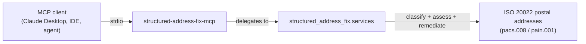

# structured-address-fix-mcp: An MCP Server for ISO 20022 Postal Addresses

[![PyPI Version][pypi-badge]][07]
[![Python Versions][python-versions-badge]][07]
[![License][license-badge]][01]
[![Tests][tests-badge]][tests-url]
[![Quality][quality-badge]][quality-url]
[![OpenSSF Scorecard][scorecard-badge]][scorecard-url]
[![Documentation][docs-badge]][docs-url]

**A [Model Context Protocol][mcp] server that exposes the
[`structured-address-fix`][core] ISO 20022 postal-address library as tools for
AI agents and assistants** — classify an address's shape, assess it against a
scheme policy, and remediate it (or a whole pacs.008 / pain.001 message) into
the structured form the November 2026 cutover requires, all from your
favourite MCP client.

> **The 14 November 2026 cliff.** On that date CBPR+, HVPS+, T2, CHAPS, and
> Fedwire stop accepting fully unstructured postal addresses: a payment whose
> debtor/creditor address is a free-text blob is rejected. `structured-address-fix-mcp`
> puts the readiness check and the fix in front of your agent — `assess_message`
> flags the offending parties, `remediate_message` proposes the compliant form,
> and `get_cutover_date` reports the binding date. **v0.1.0**, stdio transport,
> 9 tools, Python 3.12+.

## Contents

- [Overview](#overview)
- [The ISO 20022 MCP Suite](#the-iso-20022-mcp-suite)
- [Install](#install)
- [Quick Start](#quick-start)
- [Tools](#tools)
- [Using the tools](#using-the-tools)
- [Related MCP Servers](#related-mcp-servers)
- [When not to use structured-address-fix-mcp](#when-not-to-use-structured-address-fix-mcp)
- [Development](#development)
- [Security](#security)
- [Documentation](#documentation)
- [License](#license)
- [Contributing](#contributing)
- [Acknowledgements](#acknowledgements)

## Overview

The [Model Context Protocol][mcp] (MCP) is an open standard that lets AI agents
and assistants discover and call external tools in a uniform way.
**structured-address-fix-mcp** is an MCP server that turns the
[`structured-address-fix`][core] library into a set of first-class agent tools,
so an assistant can read a postal address — or every addressed party in an
**ISO 20022 `pacs.008` / `pain.001` message** — and bring it into line with the
structured-address rules that become mandatory on **14 November 2026**,
directly from a conversation.

The headline capability is the one-shot remediation workflow: assess a message,
find the parties whose addresses will be rejected at the cliff, and emit the
compliant form with each change explained and confidence-scored.

Every tool is a thin, typed wrapper over `structured_address_fix.services` —
the single shared facade also used by the CLI — so all interfaces behave
identically. Tools return JSON-serialisable data; on an error they return an
`{"error": ...}` payload rather than raising.

- **Website:** <https://sebastienrousseau.github.io/structured-address-fix/>
- **Source code:** <https://github.com/sebastienrousseau/structured-address-fix-mcp>
- **Bug reports:** <https://github.com/sebastienrousseau/structured-address-fix-mcp/issues>



## The ISO 20022 MCP Suite

`structured-address-fix-mcp` is the **postal-address specialist** in a set of
coordinated, vendor-neutral MCP servers for the ISO 20022 migration.
Dependency ranges are kept aligned across the suite, so the servers co-install
cleanly in a single Python environment: start with one, add the rest as your
workflow grows.

| Server | Scope | Install | Use it when |
|------|------|------|------|
| [`structured-address-fix-mcp`](#install) | ISO 20022 postal-address classification, assessment, and remediation for the Nov 2026 structured-address cliff | `pip install structured-address-fix-mcp` | You need to get debtor/creditor addresses cliff-ready — **this package** |
| [`pacs008-mcp`](https://github.com/sebastienrousseau/pacs008-mcp) | Generate, validate, parse & scheme-check ISO 20022 pacs.008 FI-to-FI credit transfers, with Nov-2026 address linting | `pip install pacs008-mcp` | You work with pacs.008 messages end to end |
| [`pain001-mcp`](https://github.com/sebastienrousseau/pain001-mcp) | Generate & validate ISO 20022 pain.001 payment-initiation files (v03–v12, pain.008, SEPA) with rulebook checks | `pip install pain001-mcp` | You originate outbound payment files |
| [`camt053-mcp`](https://github.com/sebastienrousseau/camt053-mcp) | ISO 20022 camt.05x bank statements: parse, validate, filter, reverse; MT94x migration; CBPR+ readiness | `pip install camt053-mcp` | You work with bank-to-customer statements |

The suite also includes the [`iso20022-mcp`](https://github.com/sebastienrousseau/iso20022-mcp)
gateway (unified `search` / `describe` / `validate` / `generate` / `parse`
meta-tools across the whole message catalogue) and
[`acmt001-mcp`](https://github.com/sebastienrousseau/acmt001-mcp) (account
management). Where `pacs008-mcp` *lints* a message for address problems,
`structured-address-fix-mcp` is the specialist that *classifies, assesses, and
fixes* the addresses themselves against per-scheme policies.

## Install

**structured-address-fix-mcp** runs on macOS, Linux, and Windows and requires
**Python 3.12+** and **pip**. It pulls in the core `structured-address-fix`
library and the MCP SDK automatically.

```sh
python -m pip install structured-address-fix-mcp
```

<details>
<summary>Using an isolated virtual environment (recommended)</summary>

```sh
python -m venv venv
source venv/bin/activate        # macOS/Linux
venv\Scripts\activate           # Windows
python -m pip install -U structured-address-fix-mcp
```
</details>

## Quick Start

For the 10-minute install → MCP client config → first conversation
tutorial, see [`docs/quickstart.md`](docs/quickstart.md).

Launch the server over stdio (the FastMCP default transport):

```sh
structured-address-fix-mcp
```

Register it with any MCP client (e.g. Claude Desktop) by adding it to the
client's configuration:

```json
{
  "mcpServers": {
    "structured-address-fix": { "command": "structured-address-fix-mcp" }
  }
}
```

The command speaks MCP on stdin/stdout — it is meant to be launched by an
MCP client, not used interactively. The agent can then call the tools below
to assess and remediate postal addresses on demand.

## Tools

All tools delegate to the shared `structured_address_fix.services` layer, so
they behave identically to the CLI. Tools return JSON-serialisable data; on a
domain, validation, or value error they return an `{"error": ...}` payload.

- `list_policies` — List every available address policy (rulebook) with its tier (e.g. `cbpr-2026`, `sepa`, `hvps-plus`, `generic-structured`)
- `classify_address` — Classify a postal address as structured, hybrid, or unstructured (a quick shape check)
- `assess_address` — Score a single address against a policy and return its findings
- `assess_message` — Assess every addressed party in a pacs.008 / pain.001 message against a policy
- `remediate_address` — Propose the compliant form of an address, with the before/after and confidence-scored patch operations
- `remediate_message` — Assess and remediate every addressed party in a message; optionally apply the operations and return the patched XML
- `preview_patch` — Return the patch operations remediation would apply to a message (a dry run)
- `explain_finding` — Explain what a finding code (e.g. `SAF001`) means and how to resolve it
- `get_cutover_date` — Return the binding November 2026 structured-address cutover date and the scheme that sets it

Optional parameters shared across the assessment/remediation tools: `policy_id`
(defaults to `cbpr-2026`), `as_of` (an `YYYY-MM-DD` date that decides the cliff
wording; defaults to today), and `country_hint` (an ISO 3166-1 alpha-2 code to
assume when an address carries no country of its own).

## Using the tools

You can invoke the tools in-process — without a transport — straight through the
FastMCP instance. This mirrors what an agent receives over stdio. The runnable
version of this snippet lives in [`examples/mcp_tools.py`](examples/mcp_tools.py).

```python
import asyncio

from structured_address_fix_mcp import server

# A fully unstructured address: two free-text lines, no structured fields.
# At the 14 Nov 2026 cliff this form is rejected across the major schemes.
unstructured = {
    "address_lines": ["10 Downing St", "London SW1A 2AA"],
    "country": "GB",
}


async def main() -> None:
    async def call(name, args):
        result = await server.server.call_tool(name, args)
        content = result[0] if isinstance(result, tuple) else result
        return content[0].text if content else ""

    # When does the cliff bite?
    print(await call("get_cutover_date", {}))
    # -> {"date": "2026-11-14", "scheme": "SWIFT CBPR+ UG2026"}

    # What shape is this address in right now?
    print(await call("classify_address", {"address": unstructured}))
    # -> {"classification": "unstructured"}

    # Propose the compliant form, with each change explained.
    print(await call("remediate_address",
                     {"address": unstructured, "policy_id": "cbpr-2026"}))
    # -> {"policy_id": "cbpr-2026", "findings": [...], "suggestions": [...],
    #     "is_compliant_before": false, "is_compliant_after": true, ...}


asyncio.run(main())
```

Run it directly:

```sh
python examples/mcp_tools.py
```

## Related MCP Servers

Part of the **ISO 20022 MCP Suite** — open-source, Apache-2.0 licensed MCP
servers for banking and financial-services AI agents:

| Server | Purpose |
|---|---|
| [`pacs008-mcp`](https://github.com/sebastienrousseau/pacs008-mcp) | Generate, validate, parse & scheme-check ISO 20022 pacs.008 FI-to-FI credit transfers + Nov-2026 address linting |
| [`pain001-mcp`](https://github.com/sebastienrousseau/pain001-mcp) | Generate & validate ISO 20022 pain.001 payment files (v03–v12, pain.008, SEPA) with rulebook checks |
| [`camt053-mcp`](https://github.com/sebastienrousseau/camt053-mcp) | Parse, validate, filter & reverse ISO 20022 camt.05x bank statements; MT94x migration; CBPR+ readiness |
| [`acmt001-mcp`](https://github.com/sebastienrousseau/acmt001-mcp) | Generate & validate ISO 20022 acmt account-management messages |
| [`iso20022-mcp`](https://github.com/sebastienrousseau/iso20022-mcp) | Unified gateway: `search` / `describe` / `validate` / `generate` / `parse` across the pain · pacs · camt · acmt families |

## When not to use structured-address-fix-mcp

- **You have no MCP client.** This server only makes sense paired with an
  MCP-aware host (Claude Desktop, the IDE plugins, an agent framework). For
  scripted / CI use, the `structured-address-fix` CLI covers the same ground
  without the stdio protocol overhead.
- **You need a long-lived network service.** v0.1 speaks **stdio only** —
  one process per operator, launched by the client, no network surface. An
  HTTP/OAuth transport for shared, multi-tenant deployments is on the
  [roadmap](ROADMAP.md), not in this release.
- **You need streaming responses.** Tool calls return whole values, not
  streams. Large messages are assessed and remediated in one call, not
  chunked over multiple responses.
- **You need to *build* the pacs.008 / pain.001 message.** Out of scope; this
  server fixes the addresses inside a message. Use
  [`pacs008-mcp`](https://github.com/sebastienrousseau/pacs008-mcp) or
  [`pain001-mcp`](https://github.com/sebastienrousseau/pain001-mcp) to
  generate and validate the message itself.

## Development

**structured-address-fix-mcp** uses [Poetry](https://python-poetry.org/) and
[mise](https://mise.jdx.dev/).

```bash
git clone https://github.com/sebastienrousseau/structured-address-fix-mcp.git && cd structured-address-fix-mcp
mise install
poetry install
poetry shell
```

> **Note:** the server depends on the core `structured-address-fix` library.
> Until it is published to PyPI, the dev dependency group installs it from the
> sibling checkout (`../structured-address-fix`); see
> [`CONTRIBUTING.md`](CONTRIBUTING.md).

A `Makefile` orchestrates the quality gates (kept in lockstep with CI):

```bash
make check        # all gates (REQUIRED before commit): lint + type-check + test + examples
make test         # pytest
make lint         # ruff + black
make type-check   # mypy --strict
make security     # bandit
```

## Security

`structured-address-fix-mcp` is a thin wrapper — every tool delegates to
`structured_address_fix.services`, where the defence-in-depth for XML parsing
(defusedxml) lives. Tools catch the documented domain, validation, and value
errors and return an `{"error": ...}` envelope per the suite convention; they
never propagate raw exceptions to the MCP client. Reporting practice, supported
versions, and the full supply-chain posture (SLSA L3 provenance, PEP 740
attestations, SBOMs, and the NIST SP 800-218 SSDF practice mapping) are
documented in [`SECURITY.md`](SECURITY.md). Vulnerabilities go via GitHub
Private Vulnerability Reporting, not public issues.

## Documentation

- [`README.md`](README.md) — this file
- [`CHANGELOG.md`](CHANGELOG.md) — release notes
- [`SECURITY.md`](SECURITY.md) — disclosure + supported versions
- [`SUPPORT.md`](SUPPORT.md) — how to get help
- [`ROADMAP.md`](ROADMAP.md) — what's next (HTTP/OAuth transport, observability, entitlement gating)
- [`MAINTAINERS.md`](MAINTAINERS.md) — who can merge
- [`docs/quickstart.md`](docs/quickstart.md) — 10-minute install → first conversation
- [`docs/deployment-cookbook.md`](docs/deployment-cookbook.md) — stdio client configs (Claude Desktop, Cursor, containers)
- [`examples/`](examples/) — runnable scripts
- [`glama.json`](glama.json) — Glama directory manifest

---

## MCP Registry

`mcp-name: io.github.sebastienrousseau/structured-address-fix-mcp`

---

## License

Licensed under the [Apache License, Version 2.0][01]. Any contribution submitted
for inclusion shall be licensed as above, without additional terms.

## Contributing

Contributions are welcome — see the [contributing instructions][04]. Thanks to
all [contributors][05].

## Acknowledgements

Built on the [`structured-address-fix`][core] ISO 20022 postal-address library
and the [Model Context Protocol][mcp] Python SDK.

[01]: https://opensource.org/license/apache-2-0/
[04]: https://github.com/sebastienrousseau/structured-address-fix-mcp/blob/main/CONTRIBUTING.md
[05]: https://github.com/sebastienrousseau/structured-address-fix-mcp/graphs/contributors
[07]: https://pypi.org/project/structured-address-fix-mcp/
[core]: https://github.com/sebastienrousseau/structured-address-fix
[mcp]: https://modelcontextprotocol.io
[docs-badge]: https://img.shields.io/badge/Docs-structured--address--fix-blue?style=for-the-badge
[docs-url]: https://sebastienrousseau.github.io/structured-address-fix/
[license-badge]: https://img.shields.io/pypi/l/structured-address-fix-mcp?style=for-the-badge
[pypi-badge]: https://img.shields.io/pypi/v/structured-address-fix-mcp?style=for-the-badge
[python-versions-badge]: https://img.shields.io/pypi/pyversions/structured-address-fix-mcp.svg?style=for-the-badge
[quality-badge]: https://img.shields.io/github/actions/workflow/status/sebastienrousseau/structured-address-fix-mcp/ci.yml?branch=main&label=Quality&style=for-the-badge
[quality-url]: https://github.com/sebastienrousseau/structured-address-fix-mcp/actions/workflows/ci.yml
[scorecard-badge]: https://api.scorecard.dev/projects/github.com/sebastienrousseau/structured-address-fix-mcp/badge?style=for-the-badge
[scorecard-url]: https://scorecard.dev/viewer/?uri=github.com/sebastienrousseau/structured-address-fix-mcp
[tests-badge]: https://img.shields.io/github/actions/workflow/status/sebastienrousseau/structured-address-fix-mcp/ci.yml?branch=main&label=Tests&style=for-the-badge
[tests-url]: https://github.com/sebastienrousseau/structured-address-fix-mcp/actions/workflows/ci.yml
